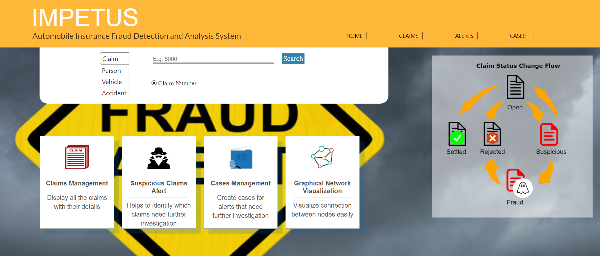

# IMPETUS 

This project is built by  [GRANDstack](https://grandstack.io) (GraphQL, React, Apollo, Neo4j Database) application. There are two components to the starter, the UI application (a React app) and the API app (GraphQL server).

IMPETUS is a Final Year Project by 
Mohamed Afiq bin Md Yassim
Zahra Omar Mohamed
A. Levenesswaran

## Quickstart

### Neo4j

You need a Neo4j instance, e.g. a [Neo4j Sandbox](http://neo4j.com/sandbox), a local instance via [Neo4j Desktop](https://neo4j.com/download), [Docker](http://hub.docker.com/_/neo4j) or a [Neo4j instance on AWS, Azure or GCP](http://neo4j.com/developer/guide-cloud-deployment) or [Neo4j Cloud](http://neo4j.com/cloud)

For schemas using the  `@cypher` directive (as in this repo) via [`neo4j-graphql-js`](https://github.com/neo4j-graphql/neo4j-graphql-js), you need to have the [APOC library](https://github.com/neo4j-contrib/neo4j-apoc-procedures) installed, which should be automatic in Sandbox, Cloud and is a single click install in Neo4j Desktop. If when using the Sandbox / cloud you encounter an issue where an error similar to `Can not be converted to long: org.neo4j.kernel.impl.core.NodeProxy, Location: [object Object], Path: users` appears in the console when running the React app, try installing and using Neo4j locally instead.


#### Local setup
1. [Download Neo4j Desktop](https://neo4j.com/download/)
2. Install and open Neo4j Desktop.
3. Create a new DB by clicking "New Graph", and clicking "create local graph".
4. Set password to "root" (as suggested by `api/.env`), and click "Create".
5. Make sure that the default credentials in `api/.env` are used. Leave them as follows: `NEO4J_URI=bolt://localhost:7687 NEO4J_USER=neo4j NEO4J_PASSWORD=root`
6.  Click "Manage".
7. Click "Plugins".
8. Find "APOC" and click "Install".
9. Click the "play" button at the top of left the screen, which should start the server. _(screenshot 2)_
10. Wait until it says "RUNNING".
11. Proceed forward with the rest of the tutorial.
12. Open up Neo4j Browser
13. Download the file impetusschema.graphml and place it in `C:/Users/YOUR_NAME`
14. Run the following command in Neo4j Browser to import the database schema
```
apoc.import.graphml("C:/Users/YOURNAME/complete.graphml",{batchSize: 10000, readLabels: true, storeNodeIds: false, defaultRelationshipType:"RELATED"})
```

### React 
You need to install react by ``` (npm i react) ```

### [`/api`](./api)

*Install dependencies*

```
(cd ./ui && npm install)
(cd ./api && npm install)
```

*Start API server*
```
cd ./api && npm start
```


### [`/ui`](./ui)

This will start the GraphQL API in the foreground, so in another terminal session start the UI development server:

*Start UI server*
```
cd ./ui && npm start
```



See [the project releases](https://github.com/grand-stack/grand-stack-starter/releases) for the changelog.

This project is licensed under the Apache License v2.
Copyright (c) 2018 Neo4j, Inc.
